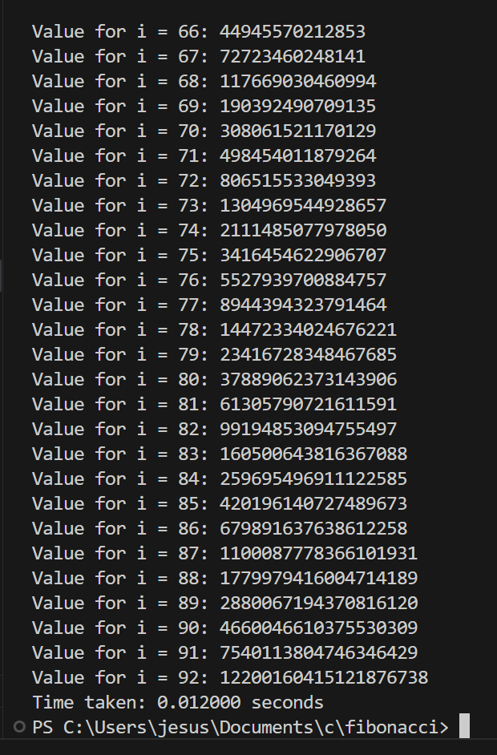

# fibonacci

## Description

This is a Fibonacci implementation made in 40 minutes during the Business Modelling class.

It uses a dynamic programming idea: an array to store previous calculations. That speed up in orders of magnitude our app, now it just takes 0.01 seconds in my laptop.

During this project we noticed the biggest C data type we could work with was **unsigned long long**. We realized that the last number we could store was the 93rd one of the Fibonacci sequence (i=92 starting from i=0).

Then, sadly, we concluded that we still live in the computing prehistory.

## Authors

[Manuel Camacho Campos (iBManu)](https://github.com/iBManu) and [Jesús García Gutiérrez (Jiuso)](https://github.com/Jiuso1).
